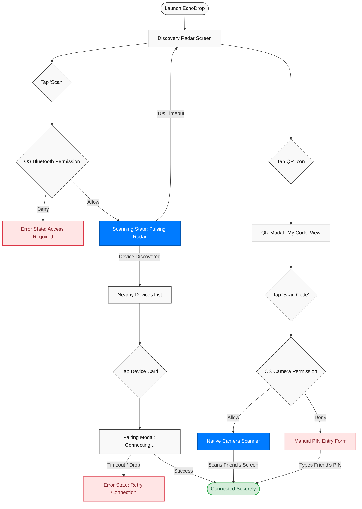

# 📡 EchoDrop

**A privacy-first, purely local Peer-to-Peer (P2P) file and clipboard sharing utility.**

---

## 📖 The Vision: Why Build EchoDrop?

 EchoDrop was conceived to bridge the gap between high-speed local data transfer and absolute user privacy.  By leveraging **Bluetooth Low Energy (BLE)** and **Capacitor's native bridge**, it eliminates the 'Cloud Middleman,' proving that modern web technologies can deliver high-performance, hardware-integrated mobile experiences.

This project sits at the intersection of web tech and native hardware.  It demonstrates enterprise-grade mobile development skills by managing complex device permissions, handling hardware-level discovery, and maintaining a high-performance UI using Angular Signals.

## ✨ Key Native Features

* **100% Offline P2P Discovery:** Utilizes pure Bluetooth LE GATT characteristics to broadcast and scan for peers without internet routing.
* **Graceful Hardware Handling:** Implements robust error states to catch native permission denials and hardware killswitches (e.g., Bluetooth toggled off) without crashing the application.
* **Native File Chunking Protocol:** Enforces a 2MB transfer limit, slicing files into 128-byte packets and streaming them with asynchronous delays to prevent native hardware buffer overflows.
* **Tactile Haptic Feedback:** Integrates `@capacitor/haptics` to provide physical feedback during discovery (light impact) and successful transfers (double-pulse).
* **QR Code & Camera Fallback:** Features a native camera overlay scanner (`@capacitor-community/barcode-scanner`) to generate and read secure Room IDs in highly congested BLE environments.
* **OS-Responsive Design:** Engineered with a dynamic CSS variable system responding natively to `prefers-color-scheme` and respecting physical safe-area boundaries (notches/nav bars).

## 🏗️ Technical Architecture Diagram

## 🧠 Engineering Highlights

1. Angular 17 Standalone & Signals
EchoDrop abandons legacy NgModules in favor of a highly optimized, lazy-loaded Standalone Component architecture. Global state management (like tracking active scans and discovered peers) is handled entirely by Angular Signals, eliminating complex RxJS subscriptions and preventing UI flickering during rapid BLE polling.

2. The Payload Assembly Engine
To handle file transfers over low-bandwidth BLE connections, I built a custom router. It parses incoming JSON metadata flags, reconstructs out-of-order 128-byte data chunks back into a base64 string, and natively saves the final binary file to the device's local Documents directory using @capacitor/filesystem

3. Strict 10-Second Race Conditions
To prevent the application from hanging indefinitely if a target device drops out of range mid-handshake, the native Bluetooth connection promise is fortified with a strict 10-second timeout race condition.

## 🛠️ Local Development Setup

To run this project on a physical device (Emulators/Simulators do not support BLE scanning):

# Clone the repository

git clone [https://github.com/yourusername/echodrop-p2p-ionic.git](https://github.com/yourusername/echodrop-p2p-ionic.git)

# Install dependencies

npm install

# Build the Angular application

ionic build

# Synchronize native iOS and Android projects

npx cap sync

# Open in native IDEs to deploy to physical devices

npx cap open ios
npx cap open android
